# Client Explainer: How $0-Cost Custom Email Routing Works

This document serves as a non-technical guide and sales tool to show your clients how custom email routing works, its benefits, and how it simplifies their daily business operations.

---

## The Core Concept
Email routing acts as a **smart digital bridge** for your business. It gives you the professional look of a custom business email address without the monthly subscription costs or the hassle of checking multiple inboxes.

```mermaid
graph TD
    classDef client fill:#f0f9ff,stroke:#0284c7,stroke-width:2px,color:#0369a1;
    classDef routing fill:#ecfdf5,stroke:#10b981,stroke-width:2px,color:#047857;
    classDef owner fill:#fff7ed,stroke:#ea580c,stroke-width:2px,color:#c2410c;

    subgraph Inbound ["1. Customers Email You (Inbound Flow)"]
        A[Customer writes to contact@yourbrand.com]:::client -->|Arrives at Domain| B(Cloudflare Routing Bridge):::routing
        B -->|Frictionless Forward| C(Your Existing Gmail Account):::owner
    end

    subgraph Outbound ["2. You Respond to Customers (Outbound Flow)"]
        D(You reply from your Gmail account):::owner -->|Uses secure SMTP relay| E(Gmail Domain Mask):::routing
        E -->|Delivered as contact@yourbrand.com| F[Customer receives mail from contact@yourbrand.com]:::client
    end
```

---

## Why Choose Email Routing? (The Client Value Proposition)

### 1. Unified Inbox (No App Hopping)
Instead of logging into multiple apps or mail servers, you receive and reply to everything directly from your existing personal Gmail account. It keeps your daily operations simple and organized.

### 2. Professional Branding
Your clients only see your custom professional address (e.g., `contact@yourbrand.com`). Your personal Gmail address remains completely hidden and private.

### 3. $0 Ongoing Cost
Standard business email setups (like Google Workspace or Microsoft 365) cost **$6 to $12 per user every single month**. Email routing uses secure, modern infrastructure to deliver the exact same service for **$0/month**.

---

## Comparison Table for Clients

| Feature | Standard Paid Email | PracWiz Custom Routing |
| :--- | :--- | :--- |
| **Monthly Subscription** | ❌ $72 - $144 / year per user |  $0 / year (Free Forever) |
| **Email Interface** | ❌ Must manage a new inbox/app |  Uses your familiar Gmail inbox |
| **Custom Domain (`@brand.com`)**|  Yes |  Yes |
| **Outgoing Domain Masking** |  Yes |  Yes |
| **Maintenance Overhead** | ❌ Regular licensing renewals |  Zero maintenance |
